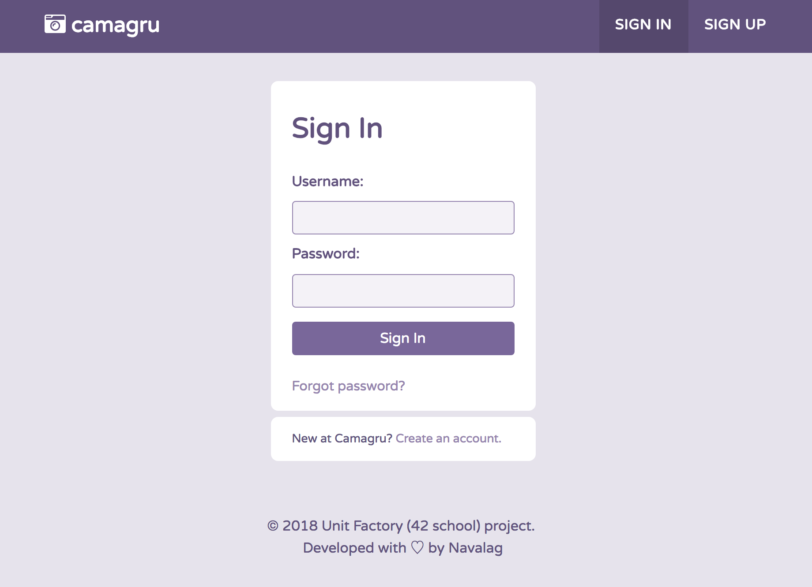

# A small Instagram-like site allowing users to create and share photo-montages
## Simply make photo :camera:, add funny effects :sparkles: and leave your footprint :feet: in history.

Camagru is the project developed without any frameworks nor external libraries, only with native PHP, JavaScript, CSS and HTML.

The idea is to create a small web application where users can make basic photo editing using theirs webcams and some predefined images.

App's users can select an image in a list of superposable images (for example a picture frame or other "we don't wanna know what you are using this for" objects), take picture with his/her webcam and admire the result that is mixing both pictures.

All captured images are public, likeables and commentable.

**Please find subject with full description :point_right: [here](camagru.en.pdf) :point_left:.**

## DESCRIPTION OF MY IMPLEMENTATION:

### The project is divided into :three: parts.

#### :one: Profile Page:

:large_orange_diamond:  get access to the camera (check it in different browsers);
 
:large_orange_diamond:  making photo;
 
:large_orange_diamond:  upload image from computer;
 
:large_orange_diamond:  add frames, effects or filters on captured photo or as preview on video stream;
 
:large_orange_diamond:  save edited image to a personal gallery (and of course - database :wink:);
 
:large_orange_diamond:  delete personal images.
 
#### :two: User Management:

:large_orange_diamond:  sign up;
 
:large_orange_diamond:  sign in;
 
:large_orange_diamond:  sign out;
 
:large_orange_diamond:  email confirmation;
 
:large_orange_diamond:  edit profile;
 
:large_orange_diamond:  change password;
 
:large_orange_diamond:  forgot password.
 
#### :three: Public Gallery:

:large_orange_diamond:  show all images from all users ordered by date of creation;
 
:large_orange_diamond:  allow like images;
 
:large_orange_diamond:  allow comment images;
 
:large_orange_diamond:  add pagination.

### Structure of the project:

At the root of repository you can find 3 main page layouts:
- index.php (gallery part),
- account.php (profile page),
- settings.php (user managment).

At **/inc** folder :file_folder: you can find **header**, **footer**, **sign in**, **sign up** forms, **additional PHP scripts** and **function.php** script where stored all the functions used for this app.

At **/config** :file_folder: stored database configurations and setup files.

Also please find JavaScript and CSS files in **/js** :file_folder: and **/css** :file_folder: folders according.

## USEFUL LINKS:

:large_blue_diamond:  [Tutorial how to take video stream from webcam and make photo](https://developer.mozilla.org/en-US/docs/Web/API/WebRTC_API/Taking_still_photos)

:large_blue_diamond:  [Tutorial how to edit img with JavaScript](https://developer.mozilla.org/en-US/docs/Web/API/Canvas_API/Tutorial/Using_images)

:large_blue_diamond:  [How to debug PHP tutorial](http://blog.teamtreehouse.com/how-to-debug-in-php)

:large_blue_diamond:  [PHP Form Validation And Verification](https://www.phpjabbers.com/php-validation-and-verification-php27.html)

:large_blue_diamond:  [Generate random password PHP](https://stackoverflow.com/questions/6101956/generating-a-random-password-in-php/31284266#31284266)

:large_blue_diamond:  [Resolving PHP relative path problem](http://yagudaev.com/posts/resolving-php-relative-path-problem/)

:large_blue_diamond:  [Create comment box with PHP AJAX SQL](https://www.linkedin.com/pulse/step-instructions-create-website-comment-box-using-php-dash)

:large_blue_diamond:  [Implement likes unlikes with PHP SQL](http://codewithawa.com/posts/like-and-unlike-system-using-php-and-mysql-database)

:large_blue_diamond:  [Safe Password Hashing](http://php.net/manual/en/faq.passwords.php)

## HOW TO CONTACT ME:

If you found mistake || bug || have any questions || suggestions, please feel free to contact me at
agalavan@student.unit.ua
